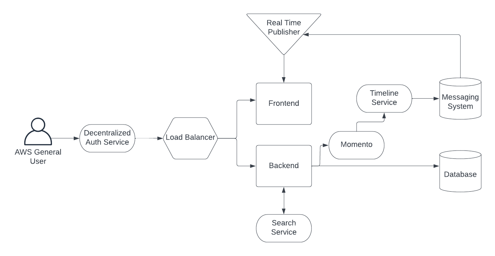
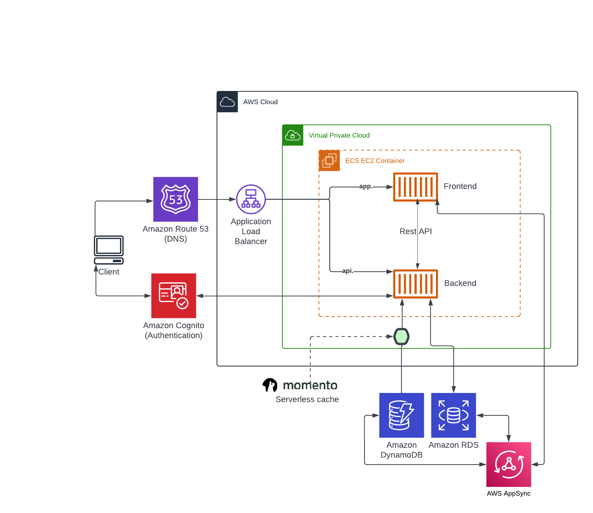

# Week 0 — Billing and Architecture

## Install AWS CLI
https://docs.aws.amazon.com/cli/latest/userguide/getting-started-install.html
- Download the AWS CLI
```ssh
curl "https://awscli.amazonaws.com/awscli-exe-linux-x86_64.zip" -o "awscliv2.zip"
```
- Unzip the CLI tool
```ssh
unzip awscliv2.zip
```
- Install the AWS CLI.
    - If you are using gitpod, first move up to the workspace directory before installing. 
```ssh
sudo ./aws/install
```
- Check the AWS version installed
```ssh
aws --version
```

## Create a new Admin user
- Create a new user in the IAM Users Console
https://us-east-1.console.aws.amazon.com/iamv2/home?region=us-east-1#/users
- In step 1, Enable console access, choose I want to create an IAM user, choose your password preferences, then click Next.
- Step 2 is used to set the user's permissions. We want to add the user to an Administrator group. 
    - If you don't have a group, create one by clicking Create group.
    - Give the group a name such as Admin.
    - Check AdministratorAccess.
    - Click Create User Group at the bottom.
- Check the Admin group you want to add the user to.
- Click Next, then Create User.
- Click the user name then click the Security Credentials tab. Now click Create Access Key.
- Choose CLI then click Next.
- Click Create Key then download the CSV file
- In the terminal, set environment variables for the following:
```sh
export AWS_ACCESS_KEY_ID=""
export AWS_SECRET_ACCESS_KEY=""
export AWS_DEFAULT_REGION=us-east-1
```
If you are using gitpod, we can tell it to remember the credentials when relaunching the workspace
```sh
gp env AWS_ACCESS_KEY_ID=""
gp env AWS_SECRET_ACCESS_KEY=""
gp env AWS_DEFAULT_REGION=us-east-1
```
You can verify that env are saved within gitpod by going here:
https://gitpod.io/user/variables

- Check that we are getting the expected user with the following command:
```sh
aws sts get-caller-identity
```
We can also save our AWS account id to the gitpod environment variables
```sh
gp env AWS_ACCOUNT_ID=$(aws sts get-caller-identity --query Account --output text)
```

## Create a Billing Alarm (GUI on AWS Console)
https://docs.aws.amazon.com/AmazonCloudWatch/latest/monitoring/monitor_estimated_charges_with_cloudwatch.html

Note: Currently you get 10 alarms free.

- Search for Billing
- On The left menu under Preferences, choose Billing Preferences.
- Check Receive Billing Alerts the click Save Preferences. If you don't check this, Billing won't show up as a metric when creating the Alarm.
- Search for and click CloudWatch.
- On the top left, directly left of your name, make sure the region is N. Virginia, because billing metric data is only stored on this region.
- Click All Alarms on the left hand menu.
- Click Create Alarm.
- Click Select Metric
- Click Billing, then click Total Estimated Charge.
- Check the EstimatedCharges metric, then click Select metric.
- From here you can adjust the metric name and condition for the alert. By default, the Threshold Type is Static and the condition is Greater than. You should give a threshold value such as 0, so the alarm will trigger when you get billed anything over the free tier. Now click next.
- In step 2, the notification page, the default Alarm state trigger is In Alarm. We can keep this value. We also need to select or create a SNS(Simple Notifications Service) topic that will receive the notification. - If you are creating a new SNS topic, give it a name, and the email where you want the notification to be received. Now click create Create Topic and wait for it to be created. Click Next.
- In step 3, give the alarm a name and description. Click Next.
- In step 4, preview your alarm settings and ensure they are correct. Now click create at the bottom right. It will take a couple of minutes to finish.

## Create a Billing Alarm (via the CLI)

- Refer to the AWS CLI docs to create a SNS Topic by running this command in the terminal
```sh
aws sns create-topic --name example-billing-alarm
```
https://docs.aws.amazon.com/cli/latest/reference/sns/create-topic.html#examples

This will give you a topic arn to use in the next command

- Refer to the AWS CLI docs to subscribe to a topic using the topic arn from the previous command's output.
```sh
aws sns subscribe \
    --topic-arn arn:aws:sns:us-east-2:123456789012:example-billing-alarm \
    --protocol email \
    --notification-endpoint my-email@example.com
```

 https://awscli.amazonaws.com/v2/documentation/api/latest/reference/sns/subscribe.html

Verify the alarm was created in the AWS Console:

https://us-east-1.console.aws.amazon.com/cloudwatch/home?region=us-east-1#alarmsV2

It may take a few minutes before the alarm is created. 
## Create an AWS budget

Note: Currently you get 2 budgets for free.

- Search and go to Billing.
- Under Cost Management click Budgets.
- Click the orange Create Budget button.
- By default a template is selected. We can use this version for now. You have multiple template options but we will keep the default, Zero spend budget.
- Give the budget a name, amount, and email recipients.
- Click create budget.

## Create an AWS budget (via the CLI)
- create folders aws and json and go to the json folder using the following command in the terminal
```sh
mkdir -p aws/json && cd aws/json
```
- Go the AWS CLI create budget documentation:
 https://awscli.amazonaws.com/v2/documentation/api/latest/reference/budgets/create-budget.html#examples
- Copy the budget.json and notifications-with-subscribers.json examples into the json folder
- Run this command in your terminal to create the budget
```sh
aws budgets create-budget \
    --account-id $AWS_ACCOUNT_ID \
    --budget file://aws/json/budget.json \
    --notifications-with-subscribers file://aws/json/notifications-with-subscribers.json
```
Verify your budget was created in the AWS console:

https://us-east-1.console.aws.amazon.com/billing/home#/budgets/overview

## AWS Cloudshell
- In the AWS console, search and click AWS Cloudshell.
-  You can use this to run commands using the AWS CLI instead of installing AWS CLI in gitpod or locally.


## Cruddur Conceptual Diagram
 


## Cruddur Logical Diagram
 