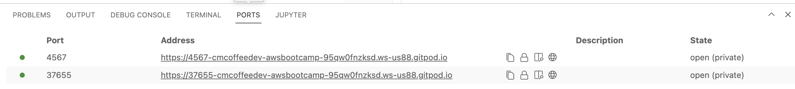
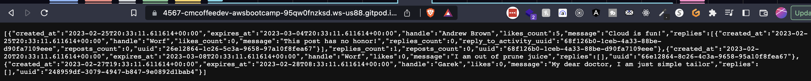
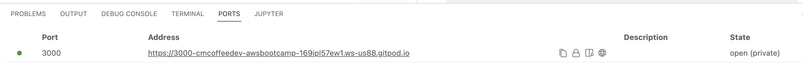
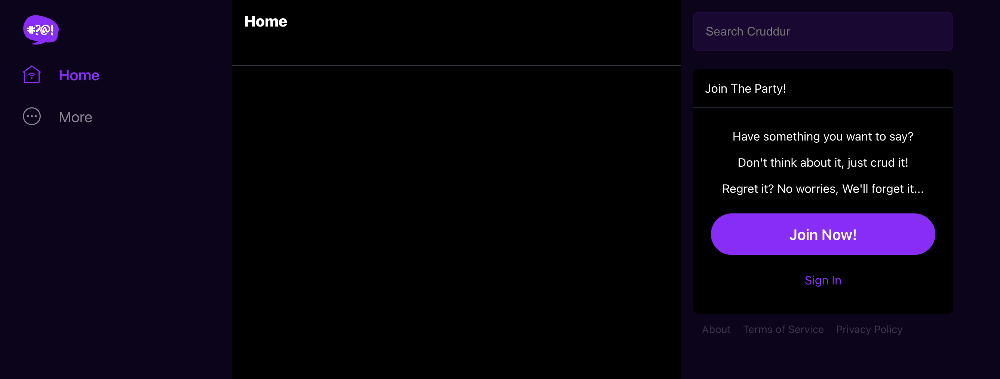

# Week 1 — App Containerization

## Run the flask backend
Go to the backend directory `backend-flask`
```sh
cd backend-flask
```

Set the backend and frontend url environment variables by entering the following in the terminal
```sh
export FRONTEND_URL="*"
export BACKEND_URL="*"
```

Install the backend dependencies by running this command in the terminal 
```sh
pip3 install -r requirements.txt
```

Run the backend python app
```sh
python3 -m flask run --host=0.0.0.0 --port=4567
```

Go the ports tab( by the terminal tab) and make sure the port defined above is unlocked



Click the circle/globe/internet icon (2 icons to the right of unlock), to get the URL of the backend. It should open in a new tab.

In the new tab in the browser, append `/api/activities/home` to the url and press enter. You should now get a response. 




## Containerize the backend
We are going to put the previous steps in a Dockerfile. In the backend-flask folder, create a new file called Dockerfile and enter the following contents
```dockerfile
FROM python:3.10-slim-buster

WORKDIR /backend-flask

COPY requirements.txt requirements.txt
RUN pip3 install -r requirements.txt

COPY . .

ENV FLASK_ENV=development

EXPOSE ${PORT}
CMD [ "python3", "-m" , "flask", "run", "--host=0.0.0.0", "--port=4567"]
```
Build the backend container using the Dockerfile

```sh
docker build -t  backend-flask ./backend-flask
```

Use this command to run the backend in the background(-d flag)
```sh
docker run --rm -p 4567:4567 -it -e FRONTEND_URL='*' -e BACKEND_URL='*' -d backend-flask
```

Use the command `docker ps` to see the docker process.

To stop the backgrounded container you can get the container id from the `docker ps` command and run
```sh
docker stop <container id>
```

You can also delete the docker image with the following command

```sh
docker image rm backend-flask --force
```
## Run the frontend
Go to the frontend-react-js directory
```sh
cd frontend-react-js
```

Install the node packages by running this command
```sh
npm i
```

Run the frontend
```sh
npm start
```

You can get the URL for the frontend from the ports tab. 



The frontend should look like this


## Containerize the frontend
Create a file in frontend-react-js called Dockerfile with the following contents

```dockerfile
FROM node:16.18

ENV PORT=3000

COPY . /frontend-react-js
WORKDIR /frontend-react-js
RUN npm install
EXPOSE ${PORT}
CMD ["npm", "start"]
```

Build the container
```sh
docker build -t frontend-react-js ./frontend-react-js
```

Run the container
```sh
docker run --rm -p 3000:3000 -it -d frontend-react-js
```

Use the command `docker ps` to see the docker process.

To stop the backgrounded container you can get the container id from the `docker ps` command and run
```sh
docker stop <container id>
```

You can also delete the docker image with the following command

```sh
docker image rm backend-flask --force
```

## Using docker-compose to create multiple containers

At the root of your project, add a `docker-compose.yml` file.
```yaml
version: "3.8"
services:
  backend-flask:
    environment:
      FRONTEND_URL: "https://3000-${GITPOD_WORKSPACE_ID}.${GITPOD_WORKSPACE_CLUSTER_HOST}"
      BACKEND_URL: "https://4567-${GITPOD_WORKSPACE_ID}.${GITPOD_WORKSPACE_CLUSTER_HOST}"
    build: ./backend-flask
    ports:
      - "4567:4567"
    volumes:
      - ./backend-flask:/backend-flask
  frontend-react-js:
    environment:
      REACT_APP_BACKEND_URL: "https://4567-${GITPOD_WORKSPACE_ID}.${GITPOD_WORKSPACE_CLUSTER_HOST}"
    build: ./frontend-react-js
    ports:
      - "3000:3000"
    volumes:
      - ./frontend-react-js:/frontend-react-js

# the name flag is a hack to change the default prepend folder
# name when outputting the image names
networks: 
  internal-network:
    driver: bridge
    name: cruddur
```

In your terminal build and run the frontend and backend using the following terminal command.
```sh
docker-compose up
```

You can use the ports tab to get the links of both and also unlock the ports if necessary.

You can shut down the containers using the following terminal command.
```sh
docker-compose down
```

## Update the open api spec
Open the `openapi-3.0.yml` file and add the following path

```yaml
  /api/activities/notifications:
    get:
      description: 'Return a feed of activities for all of those I follow'
      parameters: []
      tags:
        - activities
      responses:
        '200':
          description: Returns an array of activities
          content:
            application/json:
              schema:
               type: array
               items:
                $ref: '#/components/schemas/Activity'
```

## Add the notifications activity service on the backend


In `backend-flask/services/app.py` add the following route:
```python
@app.route("/api/activities/notifications", methods=['GET'])
def data_notifications():
  data = NotificationActivities.run()
  return data, 200
```

Also add this import under the other imports
```python
from services.notifications_activity import *
```

Also add a new service `notifications_activity.py`

```python
from datetime import datetime, timedelta, timezone
class NotificationActivities:
  def run():
    now = datetime.now(timezone.utc).astimezone()
    results = [{
      'uuid': '68f126b0-1ceb-4a33-88be-d90fa7109eee',
      'handle':  'memberone',
      'message': 'hello world!',
      'created_at': (now - timedelta(days=2)).isoformat(),
      'expires_at': (now + timedelta(days=5)).isoformat(),
      'likes_count': 5,
      'replies_count': 1,
      'reposts_count': 0,
      'replies': [{
        'uuid': '26e12864-1c26-5c3a-9658-97a10f8fea67',
        'reply_to_activity_uuid': '68f126b0-1ceb-4a33-88be-d90fa7109eee',
        'handle':  'Worf',
        'message': 'This post has no honor!',
        'likes_count': 0,
        'replies_count': 0,
        'reposts_count': 0,
        'created_at': (now - timedelta(days=2)).isoformat()
      }],
    },
    {
      'uuid': '66e12864-8c26-4c3a-9658-95a10f8fea67',
      'handle':  'Worf',
      'message': 'I am out of prune juice',
      'created_at': (now - timedelta(days=7)).isoformat(),
      'expires_at': (now + timedelta(days=9)).isoformat(),
      'likes': 0,
      'replies': []
    },
    {
      'uuid': '248959df-3079-4947-b847-9e0892d1bab4',
      'handle':  'Garek',
      'message': 'My dear doctor, I am just simple tailor',
      'created_at': (now - timedelta(hours=1)).isoformat(),
      'expires_at': (now + timedelta(hours=12)).isoformat(),
      'likes': 0,
      'replies': []
    }
    ]
    return results
```

## Update the frontend for the notifications service

In `frontend-react-js/src/pages/NotificationsFeedPage.js` add the the import:
```javascript
import NotificationsFeedPage from './pages/NotificationsFeedPage';
```

Also add the route for the page
```javascript
 {
    path: "/notifications",
    element: <NotificationsFeedPage />
 },
```


Under the pages directory, create a new file `NotificationsFeedPage.js`

```javascript
import './NotificationsFeedPage.css';
import React from "react";

import DesktopNavigation  from '../components/DesktopNavigation';
import DesktopSidebar     from '../components/DesktopSidebar';
import ActivityFeed from '../components/ActivityFeed';
import ActivityForm from '../components/ActivityForm';
import ReplyForm from '../components/ReplyForm';

// [TODO] Authenication
import Cookies from 'js-cookie'

export default function NotificationsFeedPage() {
  const [activities, setActivities] = React.useState([]);
  const [popped, setPopped] = React.useState(false);
  const [poppedReply, setPoppedReply] = React.useState(false);
  const [replyActivity, setReplyActivity] = React.useState({});
  const [user, setUser] = React.useState(null);
  const dataFetchedRef = React.useRef(false);

  const loadData = async () => {
    try {
      const backend_url = `${process.env.REACT_APP_BACKEND_URL}/api/activities/notifications`
      const res = await fetch(backend_url, {
        method: "GET"
      });
      let resJson = await res.json();
      if (res.status === 200) {
        setActivities(resJson)
      } else {
        console.log(res)
      }
    } catch (err) {
      console.log(err);
    }
  };

  const checkAuth = async () => {
    console.log('checkAuth')
    // [TODO] Authenication
    if (Cookies.get('user.logged_in')) {
      setUser({
        display_name: Cookies.get('user.name'),
        handle: Cookies.get('user.username')
      })
    }
  };

  React.useEffect(()=>{
    //prevents double call
    if (dataFetchedRef.current) return;
    dataFetchedRef.current = true;

    loadData();
    checkAuth();
  }, [])

  return (
    <article>
      <DesktopNavigation user={user} active={'home'} setPopped={setPopped} />
      <div className='content'>
        <ActivityForm  
          popped={popped}
          setPopped={setPopped} 
          setActivities={setActivities} 
        />
        <ReplyForm 
          activity={replyActivity} 
          popped={poppedReply} 
          setPopped={setPoppedReply} 
          setActivities={setActivities} 
          activities={activities} 
        />
        <ActivityFeed 
          title="Home" 
          setReplyActivity={setReplyActivity} 
          setPopped={setPoppedReply} 
          activities={activities} 
        />
      </div>
      <DesktopSidebar user={user} />
    </article>
  );
}
```

Create a new file `NotificationsFeedPage.css`
```css
article {
    display: flex;
    flex-direction: row;
    justify-content: center;
}
```

Run both apps using docker-compose.

Go to the sign up page and enter your sign up information. This only creates an account locally for now. On the confirm page use the previously entered email and `1234` as the confirm code. 

## Setting up DynamoDB and Postgres

Add the following to the `docker-compose.yml` file

```yaml
db:
    image: postgres:13-alpine
    restart: always
    environment:
      - POSTGRES_USER=postgres
      - POSTGRES_PASSWORD=password
    ports:
      - '5432:5432'
    volumes: 
      - db:/var/lib/postgresql/data
dynamodb-local:
    # https://stackoverflow.com/questions/67533058/persist-local-dynamodb-data-in-volumes-lack-permission-unable-to-open-databa
    # We needed to add user:root to get this working.
    user: root
    command: "-jar DynamoDBLocal.jar -sharedDb -dbPath ./data"
    image: "amazon/dynamodb-local:latest"
    container_name: dynamodb-local
    ports:
      - "8000:8000"
    volumes:
      - "./docker/dynamodb:/home/dynamodblocal/data"
    working_dir: /home/dynamodblocal
```

Also add volumes at the bottom of `docker-compose.yml`

```yaml
volumes:
  db:
    driver: local
```

Run docker compose
```sh
docker-compose up
```